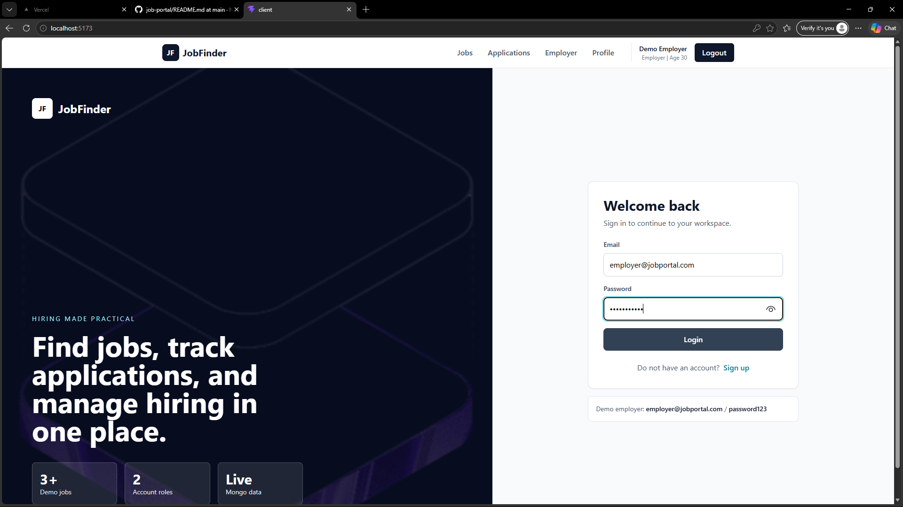

# Job Portal Web Application

A full-stack Job Portal web application built using the MERN stack. This platform allows users to browse jobs, apply for positions, and enables admins/recruiters to manage job listings efficiently.

## Features

### User Side

- Register & Login Authentication
- Browse all available jobs
- Apply for jobs
- View applied jobs

### Admin/Recruiter Side

- Add new job listings
- Update/Delete jobs
- Manage applicants

## Tech Stack

Frontend (Client)

- React.js (with Vite)
- Tailwind CSS
- Axios

Backend (Server)

- Node.js
- Express.js
- MongoDB (Mongoose)

## Project Structure

job-portal/
│
├── client/        # Frontend (React + Vite)
├── server/        # Backend (Node + Express)

## screensort

## Installation & Setup

1 Setup Backend

cd server
npm install
npm start

2 Setup Frontend

Open new terminal:

cd client
npm install
npm run dev

## Future Improvements

- Resume upload feature
- Email notifications
- Advanced job filtering
- Admin dashboard UI improvements
